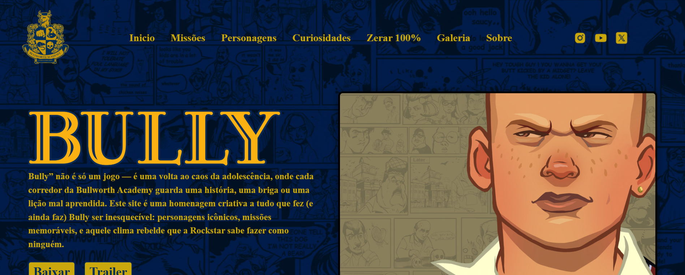
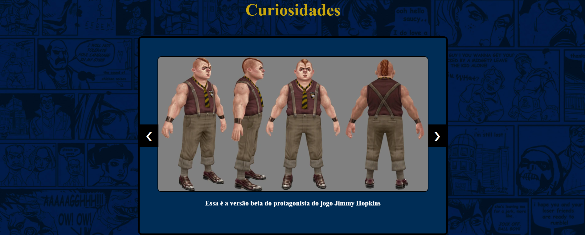
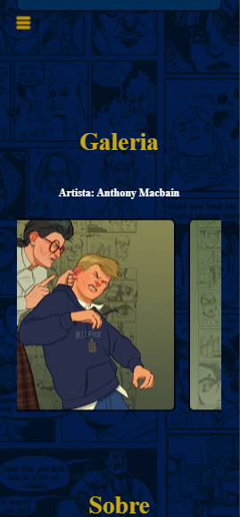

<h1 align="center">👊 Guia Interativo de Bully</h1>

  

  <strong>Uma homenagem ao jogo mais marcante da minha infância.</strong> 
  Feito com HTML, CSS e JavaScript puro — com carinho, dedicação e nostalgia.

---

## 🎮 Sobre o projeto

O **Guia Bully** é um site interativo com foco em ajudar jogadores a:
- Conhecer melhor os personagens,
- Descobrir curiosidades do universo do jogo,
- Saber exatamente o que fazer para zerar Bully 100%,
- E se localizar com o **mapa completo** do game.

Tudo isso com um visual personalizado, responsivo, com modo claro/escuro e animações suaves, respeitando a estética original do jogo.

---

## ✨ Funcionalidades

✔️ Interface responsiva e adaptada para mobile  
✔️ Modo escuro e claro com transições suaves  
✔️ Galeria de personagens com hover animado  
✔️ Lista completa e ilustrada para 100% do jogo  
✔️ Mapa de Bullworth Academy integrado  
✔️ Estilo visual próprio, inspirado na estética do game  

---

## 📸 Screenshots

  
  
  

---

## 🧠 Por que esse projeto?

> Bully foi mais do que um jogo: foi parte da minha infância, me acompanhando em momentos difíceis e despertando meu interesse por narrativas, design e arte.  
> Este projeto é uma forma de **honrar essa memória**, enquanto pratico HTML, CSS e JavaScript puros com atenção aos detalhes e acessibilidade.

---

## 🚀 Deploy

Você pode acessar o projeto online aqui:  
🔗 [https://guia-bully.vercel.app](https://guia-bully.vercel.app) <!-- Substitua esse link após hospedar na Vercel -->

---

## 🧩 Tecnologias utilizadas

- HTML5 semântico  
- CSS3 com variáveis, media queries e transições  
- JavaScript puro para interações e modo dark  
- Estrutura organizada por seções  
- Planejamento visual feito por mim com base no jogo

---

## 📌 Autor

Desenvolvido por [Henrique Aguiar dos Santos](https://www.linkedin.com/in/henrique-aguiar-269b89233) 💻🌹  
Se quiser me apoiar ou compartilhar, veja o post especial no LinkedIn:  
👉 [Leia minha história com o projeto](https://www.linkedin.com/in/henrique-aguiar-269b89233) <!-- Atualize após postar -->

---

    
   
  <i>"Canis Canem Edit."</i>

